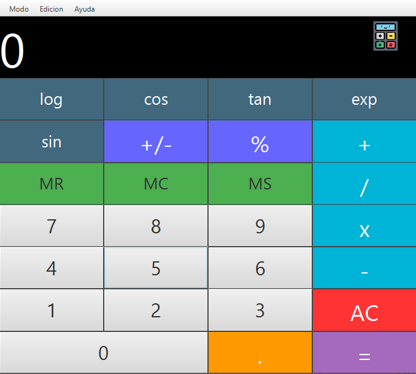
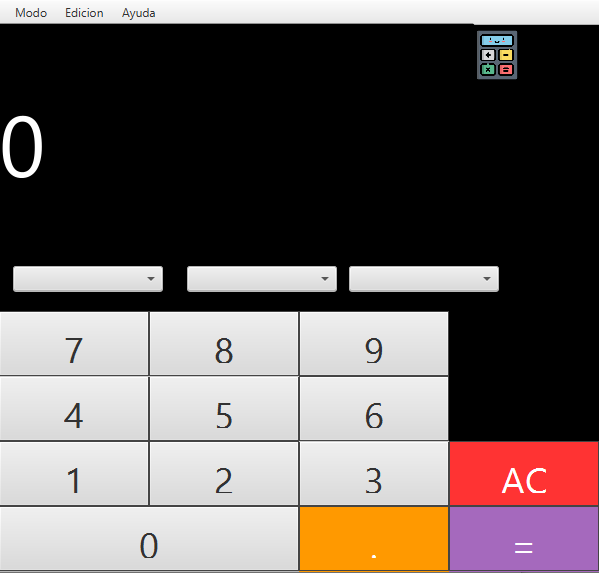
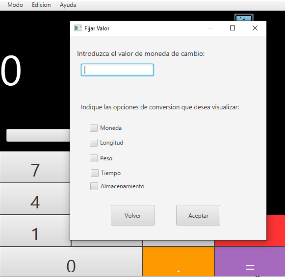

# CALCULADORA
<p>
En ambas ventanas encontrará una barra de navegación donde puede encontrar ***Modo, Edicion y Ayuda***
</p>
                    
Modo  | Edición | Ayuda
------------- | -------------
Calc. Conversiones  | Fijar Valor | 
Científica  | 
                
## Calculadora de conversiones 
<p>
En primer lugar nos aparece la calculadora de conversiones que para ser utilizada hay que seguir estos pasos:
</p>
- En primero lugar en el apartado de edición -> fijar valor deberá seleccionar el los valores de conversion que desea utilizar.
- En segundo lugar, una vez seleccionado el valor en el primer combobox apareceran todos los valores anteriormente seleccionados.
- En tercer lugar, en los combobox 2 y 3 podrá seleccionar los valores de conversion según el valor fijado.
- Debe saber que si elige como valor de conversión "moneda" la diferencia que hay de dolares a euros y al revés se carga automáticamente y de una API en tiempo real:
`<link API>` : <https://www.exchangerate-api.com>

## Calculadora de científica

En esta calculadora encontrarás:
- Operaciones basicas: como sumar, restar, multiplicar y dividir.
- Operaciones avanzadas: como porcentajes, conseno, tangente...
- Cambio de símbolo
- Operaciones de guardado en memoria: donde podras guardar el resultado en memoria  ***MS*** o podrás borrar el valor actual de la memoria ***MR*** o podrás recuperar el valor de la memoria para seguir trabajando con el ***MC*** 

### Icono
En mi calculadora he usado un pequeño icono representativo y llamativo para el usuario: 

<p align="center">



</p>


###Sequence Diagram
                    
```seq
Calc. Conversiones->Cintífica:Edición 
Fijar valor-->Moneda: API dolar/euros
```


